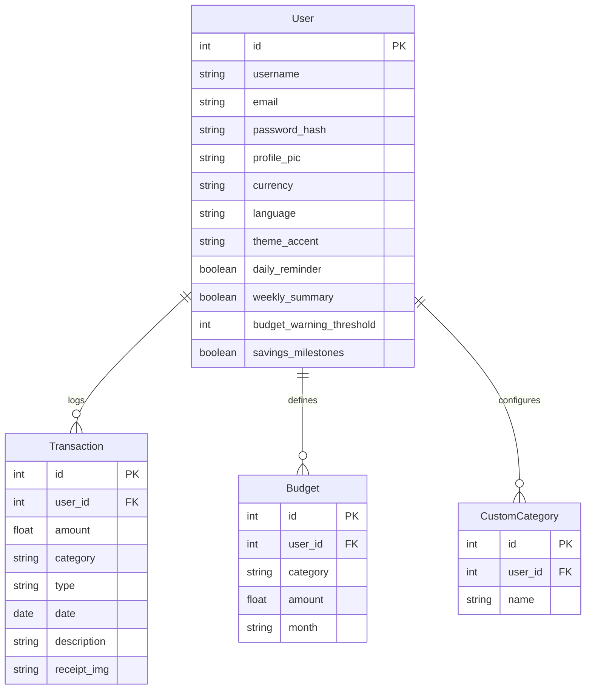

# PROJECT REPORT: EXPENSETRACKER
**Smart Personal Finance & Analytics Platform**

---

## 1. Project Title & Metadata
* **Project Name**: ExpenseTracker
* **Platform**: Responsive Web Application
* **Backend Architecture**: Python Flask with SQLAlchemy ORM
* **Frontend Architecture**: Bootstrap 5, Vanilla JavaScript, Chart.js
* **Database**: SQLite
* **Developer**: Shreya Sagar
* **Repository**: [https://github.com/shreya-code-hub/expense-tracker](https://github.com/shreya-code-hub/expense-tracker)

---

## 2. Introduction & Objective
In today's fast-paced economic landscape, tracking individual financial behaviors is essential for long-term stability and smart wealth generation. **ExpenseTracker** is a premium personal finance application built to help users manage their financial health. 

The primary objective of this project is to provide an intuitive, high-performance, and visually striking platform for logging income and expenses, establishing budgets, and analyzing spending patterns over time. The application is designed to be highly secure, private, and localized to adapt to users across different geographical regions and languages.

---

## 3. Technology Stack
The application leverages a modular, lightweight, and modern technology stack:

### Backend Architecture
* **Python (3.10+)**: Core programming language.
* **Flask (3.0.3)**: A micro web framework used to manage routing, sessions, authentication, and API endpoints.
* **Flask-SQLAlchemy**: Object-Relational Mapper (ORM) used to interact with the database using Python objects instead of raw SQL.
* **Flask-Login**: Manages user authentication, session security cookies, and routes access validation.
* **Werkzeug**: Handles secure password hashing (`scrypt`) and safe file uploads.
* **ReportLab**: Programmatically generates customized PDF monthly financial statements.
* **python-pptx**: Builds dynamic, widescreen monthly executive slide summaries.

### Frontend Architecture
* **HTML5 & CSS3 (Vanilla)**: Structured layout with custom variables for full dark/light modes and dynamic colors.
* **Bootstrap 5**: Responsive layout grids, styled inputs, layout modals, and icons.
* **Chart.js**: Render client-side interactive charts (doughnut graphs for category allocation, bar charts for monthly trends).
* **Vanilla JavaScript**: Intercepts forms, processes asynchronous (AJAX) endpoints for dynamic notifications, switches themes, and controls the chat assistant without page reloads.

---

## 4. Database Schema Design
The application uses SQLite as its relational database. The relational design contains four key tables:



### Table Definitions:
1. **User**: Stores login credentials, custom avatar paths, and all personalization settings (currency, language, theme, and notification configurations).
2. **Transaction**: Logs transaction metadata: amount, category, type (`income` or `expense`), timestamp, optional descriptions, and receipt image attachments.
3. **Budget**: Tracks user-configured monthly limits for separate categories.
4. **CustomCategory**: Tracks user-defined category tags, merging them dynamically with default system tags.

---

## 5. Core Modules & Features

### A. Dashboard & Real-Time Analytics
* **Summary Cards**: Dynamic cards showing total income, total expenses, and net savings for the current month. Values automatically adapt to the user's chosen currency symbol.
* **Category Doughnut Chart**: Interactive chart illustrating what percentage of budget is allocated to different categories.
* **Temporal Bar Chart**: Tracks monthly comparisons over time.
* **Theme Switching**: Seamless conversion of chart configurations, scales, grid lines, and colors to match light or dark modes.

### B. Personalization Suite
* **Theme Accents**: Toggle between *Royal Indigo*, *Emerald Green*, *Rose Pink*, *Amber Yellow*, and *Ocean Blue*. The accent swatches immediately adjust button gradients, shadows, focus behaviors, and horizontal navigation bar glassmorphic fills.
* **Multi-Currency System**: Dynamically formats all UI elements, ledger items, charts, and downloadable reports into Rupees (`₹`), Dollar (`$`), Euro (`€`), or Pound (`£`).
* **Localization Engine**: Instantly translates the entire interface to English, Spanish (Español), or Hindi.

### C. Warnings & Budgets Engine
* **Interactive Limits Slider**: Set limits per category and configure warning thresholds (e.g. alert user when spending hits 80%).
* **Visual Status Tags**: Highlights "Safe", "Over Limit", or "No Limit" badges.
* **Dynamic Notifications**: The header bell lists notifications for budget alerts, daily reminder checks, weekly rollups, and savings milestone achievements.

### D. Expenso AI Chatbot
* Floating chat assistant integrated at the bottom-right corner of all authenticated pages.
* Direct AJAX communication with `/api/chat` to process queries locally.
* Can answer questions like:
  * *"What is my balance?"* (returns monthly totals and net savings)
  * *"How much did I spend on Food?"* (returns spent amount, budget limit, and warning status)
  * *"List my budgets"* (lists all category budget thresholds)
  * *"Give me financial tips"* (analyzes the database, identifies the highest spending category, and serves specialized savings guidelines)

### E. Multi-Format Report Exporter
* Generates monthly statements in three file formats:
  * **CSV**: Comma-separated spreadsheet with standard fields.
  * **PDF**: Professional styled statement with metric cards, category breakdown tables, and a full transaction log.
  * **PowerPoint**: Widescreen summary slide deck.
* **Browser Download Protection**: Double-quotes the `filename` in the `Content-Disposition` header and uses path-based redirection (`/export/YYYY-MM.pdf`) to bypass local download manager UUID rename overrides on Windows/localhost.

---

## 6. Installation & Execution Guidelines

Follow these commands to deploy and run the application inside VS Code:

### Prerequisites
Make sure **Python 3** and **pip** are installed on your machine.

### Setup Instructions
1. **Clone the repository** (or open the project directory inside VS Code terminal).
2. **Create a virtual environment**:
   ```powershell
   python -m venv venv
   ```
3. **Activate the virtual environment**:
   ```powershell
   # Windows PowerShell
   .\venv\Scripts\Activate
   ```
4. **Install dependency libraries**:
   ```powershell
   pip install -r requirements.txt
   ```
5. **Create & seed the database**:
   ```powershell
   python create_db.py
   ```
6. **Start the local server**:
   ```powershell
   python app.py
   ```
7. Open your web browser and navigate to `http://127.0.0.1:5000/`.

---

## 7. Future Scope & Roadmap
To expand this platform, future updates can integrate:
1. **AI OCR Receipt Scans**: Automatic classification of transaction records by extracting details from uploaded receipt images using optical character recognition.
2. **Bank APIs Integrations**: Safely sync dynamic bank feed entries automatically to avoid manual logging.
3. **Predictive Forecasting**: Introduce machine learning models to forecast next month's cashflow and pre-warn users of potential budget breaches.
